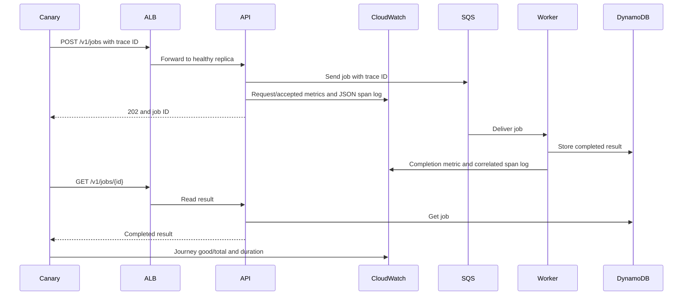
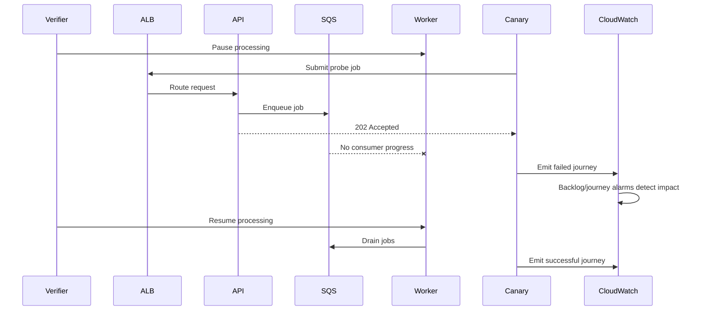

# SignalForge Service Health

## Introduction

SignalForge is an asynchronous job service whose front door can look healthy
while the customer journey is broken. An API accepts a job, a queue carries
it to a worker, and a DynamoDB result is served by the API. A continuously
running canary uses the same public path as a customer. The participant builds
the cloud infrastructure, with most of the challenge in collecting and
interpreting telemetry rather than implementing the application. All three
programs are supplied as images. The API and worker already publish structured
records to CloudWatch Logs and custom CloudWatch metrics, and the canary already emits journey
metrics. Terraform must provide their destinations, permissions, dimensions,
alarms and dashboard.

The taxonomy is **Observability and Monitoring**. SQS and DynamoDB are
necessary to create a meaningful hidden-failure condition, but neither queue
algorithm nor storage modeling dominates the solution or score. A success
requires evidence that the operator can tell apart process liveness, API
readiness, accepted work, completed work, and stale telemetry.

## Infrastructure Used

| Cloud service | Exact job |
|---|---|
| VPC, subnets and security groups | Put the public ALB in two public subnets and ECS tasks in two private subnets; allow only required ingress and workload connections. |
| Application Load Balancer | Distribute public API requests across two healthy replicas, with a readiness-based target-group check. |
| ECS | Run two API replicas, a worker, and the continuous synthetic canary. |
| SQS | Carry accepted jobs to the worker; a stalled worker leaves a measurable backlog. |
| DynamoDB | Store completed job results so the canary can verify an end-to-end result. |
| CloudWatch Logs | Retain structured API, worker and canary logs, including correlation and span records, with bounded retention. |
| CloudWatch Metrics | Store separate API, worker and journey series plus service-level numerator and denominator signals. |
| CloudWatch dashboard | Show front-door traffic, processing, journey health and alarm context from those series. |
| CloudWatch metric alarms | Detect API errors, processing backlog, failed journeys and absent canary telemetry. |
| SNS and SQS | Route alarm notifications to an inspectable incident queue. |
| IAM | Give each workload only its required application and telemetry API permissions. |

The design intentionally does not require X-Ray, CloudWatch composite alarms,
or log metric filters. The current documented Floci service matrix does not
list X-Ray, and its CloudWatch action list does not promise those alarm/filter
APIs. Trace *context* is still tested through span-shaped CloudWatch log
records emitted by the supplied application; this is not represented as a
native X-Ray trace. [Floci service matrix](https://floci.io/floci/services/)
and [CloudWatch actions](https://floci.io/floci/services/cloudwatch/)
describe the local control plane used here.

## Operational Flows

### Healthy job and telemetry

### Front door healthy, worker stalled

The verifier first proves a healthy journey, then pauses worker consumption.
The API still returns 202 and target-group health stays green. Jobs accumulate
in SQS. The canary sees incomplete journeys and publishes failures. The
monitoring system must reveal the disagreement between API readiness and
customer health. When consumption resumes, fresh journeys succeed and the
monitoring data records recovery.

### API error and latency

The API exposes documented diagnostic request headers that produce one
controlled failure or delay. This is not a participant programming task. The
verifier sends fresh requests, checks the API's actual status and elapsed
time, and then checks the corresponding CloudWatch metric and JSON log. A
healthy subsequent request demonstrates that the signal is not a static
placeholder.

### Missing telemetry

If the canary stops, no new customer-journey datapoints arrive. A missing-data
alarm must not silently treat the absence as success. The verifier confirms the
live alarm watches canary heartbeat data and checks Terraform's planned alarm
value for `treat_missing_data = "breaching"`. This uses the desired plan because
this Floci version omits that field from `DescribeAlarms` readback, and its
alarm evaluation is not reliably timed across isolated Realm runs.

### Repair and cleanup

The verifier deletes one declared monitoring resource, reruns `deploy.sh`, and
checks that Terraform recreates it while previous job results remain readable.
The final destroy must remove task-owned cloud resources and preserve the
original baseline. This tests lifecycle only as support for the monitoring
product, not as a backup or disaster-recovery exercise.

## Score

The target verifier has 20 fixed-value scored blocks. Each block earns points
only when all its experiments pass; no partial credit within a block. The
groups and points are deliberately dominated by observability outcomes.

| Group | Points |
|---|---:|
| Metrics and SLI populations | 20 |
| Structured logs and trace correlation | 15 |
| Alarms and notification routing | 20 |
| Synthetic and layered health | 15 |
| Dashboard and operational interpretation | 10 |
| Cloud deployment and declared topology | 10 |
| Lifecycle and cleanup | 10 |
| **Total** | **100** |

| Block | Proof | Points |
|---|---|---:|
| API request population | Fresh successful, failed and slow requests produce correct request and duration series. | 6 |
| Worker population | Accepted and completed jobs create distinct processing metrics. | 5 |
| Journey population | Canary good and total samples distinguish completion from acceptance. | 5 |
| SLI math | A measured ratio uses the correct numerator and denominator. | 4 |
| API JSON logs | Request logs contain timestamp, service, level, request ID and trace ID. | 4 |
| Worker JSON logs | Processing logs carry the same trace and job IDs. | 4 |
| Span linkage | API enqueue and worker consume span records link one journey. | 4 |
| Secret-safe logs | Diagnostic credentials and payload secrets do not appear in logs. | 3 |
| API error alarm | Declared alarm watches the error series with documented dimensions and threshold. | 4 |
| API latency alarm | Declared alarm watches a real latency series. | 4 |
| Backlog alarm | Queue stall is visible through a backlog alarm. | 3 |
| Journey alarm | End-to-end failure is alarmed even with a healthy ALB. | 4 |
| Telemetry-loss alarm | Missing canary data is not classified as healthy. | 2 |
| Incident routing | Alarm actions target an inspectable SNS-to-SQS incident path. | 3 |
| Layered health | Liveness, readiness and completed-journey signals are distinct. | 5 |
| Synthetic behavior | Canary uses the public path and tests an actual completed job. | 10 |
| Dashboard | Widgets cover API, processing, journey and SLO signals. | 10 |
| Declared topology | Terraform state contains connected, required compute and data resources. | 5 |
| Live topology | ALB and ECS services are reachable and connected. | 5 |
| Redeploy, repair, destroy | Idempotent redeploy repairs monitoring; cleanup preserves baseline. | 10 |
| **Total** | | **100** |

The reference solution must score 100 in Realm before release. A no-op, fake
manifest, decorative metric names without emitted data, or an API-only health
check must fail. The final score and pass threshold are 100. The score table is
a design target until every block is implemented and verified; it must be
reconciled with the actual verifier before submission.
